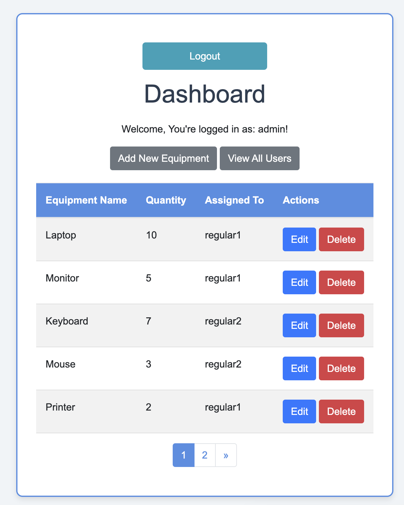
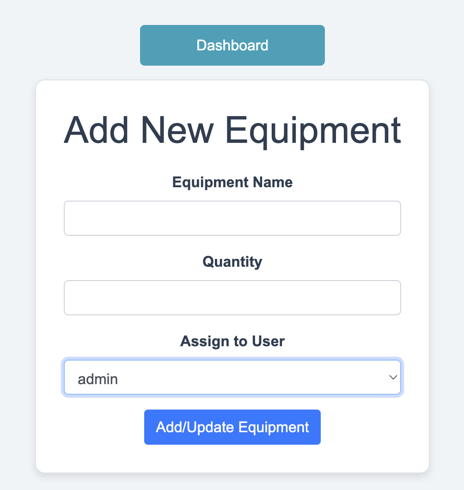

# (README) IT-Equipment Management Application 
## About the app:
This application (written in python and flask), allows inventory management of IT equipments (i.e.  monitors, keyboards etc).  Allows registration and login of two types of users: Admin users can perform full CRUD operations whilst regular userscan only add, view and update certain records only. 

## Running the Application Locally:

- 1\ Clone the repository or extract the zip file

- 2\ Create a virtual environment and install dependencies:

```bash
python3 -m venv venv                                            # Create a virtual environment
source venv/bin/activate                                        # Activate the virtual environment 
pip install -U -r requirements.txt                              # Install the updated requirements
pip install Flask Flask-SQLAlchemy Flask-Login Flask-WTF		# install Packages + Flask
```

- 3\ Set up the SQLite database:

```bash
flask db init
flask db migrate
flask db upgrade
```

- 4\ Run the application:

```bash
flask run							    # Run the App 
OR
flask --app run app				        # Run the app, specifying ‘app.py’ file
```

- 5\ Run unit tests:
```bash
python -m unittest tests/test_app.py          # run all tests 
```

## Screenshorts of the Application 
### Welcome Page (Register & Login) 


### Main Dashboard Page


### Add New Equipment Page 
